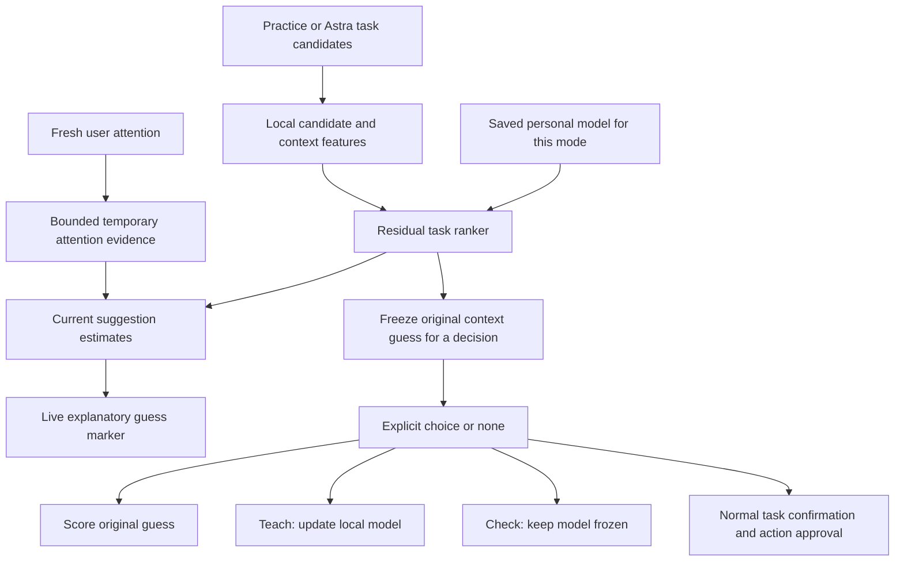

# Learning intent from interaction

Research and implementation design reviewed 8 September 2026.

The product north star is "Nerve reads our minds": anticipate intended goals before explicit instructions, progressively reducing the input and correction needed to accomplish them. The current implementation is the first measurable learning layer toward that capability. It learns which available task a person means by combining computer context, recent input, and explicit corrections. It does not directly measure an unexpressed thought. This document explains the research behind that design, the implementation selected for this iteration, and the measurements needed to establish whether it works for matt or anyone else.

The new intent learner is an engineering prototype. No human intent-accuracy improvement, reduction in physical effort, or calibrated probability of understanding is established by its implementation. Robotics and augmented-reality papers inform the architecture; their performance numbers are not Nerve benchmarks. Existing camera calibration and task execution evidence remain separate in [GAZE_RESEARCH.md](GAZE_RESEARCH.md) and [EVALUATION.md](EVALUATION.md).

## 1. Three different things to calibrate

| Layer                    | Question                                               | Useful observations                                                  | Appropriate ground truth                       |
| ------------------------ | ------------------------------------------------------ | -------------------------------------------------------------------- | ---------------------------------------------- |
| Sensor calibration       | Where is the person looking or pointing?               | Eye features, head geometry, pointer position, timestamps            | Independently presented screen targets         |
| Preference learning      | What choices tend to help this person in this context? | Explicit task choices, corrections, action families, task context    | Confirmed choices across repeated situations   |
| Current intent inference | What does the person mean right now?                   | Available tasks, present context, recent attention, deliberate input | A contemporaneous statement or explicit choice |

Authorization is separate. Existing confirmation and action approval remain independent of the learner.

These distinctions have practical consequences. Improving webcam calibration can make an attention signal cleaner without improving task understanding. Learning that someone frequently drafts replies does not establish that they want a reply now. A person can look at a message because they are reading it, checking who sent it, considering archiving it, or looking for a date. The same observation can fit several goals.

Our engineering decision is to keep these layers separately inspectable. A failed camera check should affect the reliability of gaze evidence. A rejected task should affect the task model. A failed browser action should appear as an execution failure, not automatically become a negative preference label.

## 2. What the primary sources establish

The table separates published findings from Nerve's interpretation. Paper performance does not transfer to this application.

| Primary source                                             | Relevant finding                                                                                                                           | Design implication for Nerve                                                                          |
| ---------------------------------------------------------- | ------------------------------------------------------------------------------------------------------------------------------------------ | ----------------------------------------------------------------------------------------------------- |
| Jacob, gaze interaction [^jacob]                           | Natural looking creates the Midas Touch problem: perceptual behavior can produce unwanted commands.                                        | Attention can inform suggestions; deliberate activation and approval stay separate.                   |
| Admoni and Srinivasa, gaze and shared autonomy [^admoni]   | Gaze can be an observation in a belief over possible goals. Their implementation is a pilot with a head-mounted tracker.                   | Add gaze as evidence with explicit quality limits.                                                    |
| Javdani et al., shared autonomy [^javdani]                 | Assistance can reason over multiple goals; treating autonomous movement as user evidence produces positive feedback.                       | Preserve ambiguity and distinguish user input from system-generated behavior.                         |
| Jain and Argall, personalized intent inference [^jain]     | Recursive Bayesian filtering combines observations, permits changing goals, and customizes a behavior parameter from labeled trajectories. | Maintain temporal state and learn person-specific parameters from actual choices.                     |
| Fuchs and Belardinelli, gaze sequences [^fuchs]            | Hidden Markov models use temporal patterns over areas of interest. The study is small and uses dedicated eye-tracking hardware.            | Recent history is more useful than a single gaze coordinate; webcam performance remains unproven.     |
| Han et al., multimodal Bayesian networks [^han]            | A dynamic Bayesian network combines gaze, touch, and LLM contextual knowledge. Personalization remains future work in that paper.          | Keep fast inference local and use the language model for contextual candidates.                       |
| Papoutsaki et al., WebGazer [^webgazer]                    | Browser gaze estimation can adapt using interaction-derived labels; cursor evidence weakens when the cursor becomes idle.                  | Distinguish trusted labels from inferred ones and decay stale attention.                              |
| Kumar et al., EyePoint [^eyepoint]                         | Progressive refinement combines imprecise gaze with a deliberate keyboard trigger.                                                         | Narrow ambiguous choices after an intentional attempt.                                                |
| Gopinath and Argall, active disambiguation [^gopinath]     | Selecting an informative control mode can help distinguish goals with limited input.                                                       | Clarification should reduce ambiguity with little effort.                                             |
| Weinberger et al., feature hashing [^hashing]              | Signed hashing provides a fixed-dimensional feature representation.                                                                        | Use small local vectors without constructing a vocabulary service.                                    |
| Duchi et al., AdaGrad [^adagrad]                           | Per-coordinate adaptation supports online optimization with sparse features.                                                               | Incremental learning is plausible without retraining a large model.                                   |
| Gao et al., X2T [^x2t]                                     | Online feedback adapts an existing assistive typing interface across studied input types.                                                  | Personalize a working baseline using explicit error feedback.                                         |
| Reimers and Gurevych, Sentence-BERT [^sbert]               | Learned sentence representations support semantic similarity.                                                                              | Embeddings can improve matching between differently worded tasks, but similarity alone is not intent. |
| Li et al., contextual bandits [^linucb]                    | Contextual recommendation learns from partial feedback while exploring actions.                                                            | A future recommendation experiment needs an explicit reward and exploration policy.                   |
| Joachims et al., implicit feedback [^clickbias]            | Click behavior depends on presentation and is not straightforward relevance ground truth.                                                  | Do not interpret every unchosen card as disliked or every click as successful assistance.             |
| Guo et al., probability calibration [^guo]                 | Classifier confidence and observed correctness can diverge; post-hoc calibration needs validation data.                                    | Softmax scores are model estimates until their reliability is measured.                               |
| Geifman and El-Yaniv, selective prediction [^selectivenet] | Prediction quality and coverage trade off when a model can abstain.                                                                        | Report how often the system declines to suggest as well as when it is correct.                        |

Several findings deserve emphasis. Jain and Argall explicitly optimize a person-specific parameter using labeled training trajectories and evaluate different interfaces, including end users. That supports customization, not a universal motor-behavior model. Their observation-fusion formulation assumes conditional independence, an assumption that can fail when two inputs are derived from the same underlying signal.[^jain]

Han et al. provide a close precedent for separating probabilistic interaction inference from LLM contextual knowledge. Their constrained office evaluation does not compare all alternative architectures, and they report errors when an early fragment of a gesture resembles a different complete gesture. This motivates waiting for adequate evidence before presenting a committed interpretation.[^han]

X2T is a particularly close assistive-interface precedent: it learns from feedback on the interface's output while adapting a default decoder. Its typing-specific backspace feedback does not make arbitrary browser cancellations trustworthy negative labels. The webcam, handwriting, and implanted-interface experiments also do not establish task-intent accuracy for Nerve.[^x2t]

## 3. Selected architecture

The implementation combines a local residual task ranker with a separate, temporary attention contribution. It is a lightweight approximation to the broader research direction, not an implementation of a complete POMDP, a neural intent decoder, or a contextual-bandit experiment.



Candidate generation and personalization solve different problems. Practice mode supplies deterministic candidates. Astra mode supplies context-dependent candidates through its existing flow. The learner estimates which offered candidate fits the person. If the intended task is absent, a better ranker cannot select it. An explicit none option therefore belongs in both feedback and evaluation.

Practice and Astra use separate personal models. Otherwise repetitive synthetic exercises could dominate real-task behavior, and a changing distribution of Astra candidates could distort the practice baseline. Evaluation and exported statistics must retain that distinction too.

### Local feature vectors

The selected representation uses signed hashed text features, action-family features, and context. This is a lexical and structural vector representation. It does not contain the learned language understanding of a neural sentence encoder. Words or short patterns that share a bucket can interfere, and unfamiliar paraphrases can have little overlap.

An action-family feature connects variants such as drafting different replies without identical candidate IDs. Context distinguishes situations. Features must represent information available when the guess is made, excluding future selected IDs, correctness labels, or outcomes.

The residual design preserves the base candidate score when the personal model has no useful evidence. Learning adds a bounded person-specific adjustment rather than replacing the entire starting behavior with the first few examples. Regularization and constrained weights are useful controls on the effect of accidental or contradictory labels. The exact update and numerical settings are implementation parameters to verify, not scientifically established constants.

A conceptual score is:

```text
score(candidate) = base(candidate, context)
                 + personalResidual(features(candidate, context))
                 + temporaryAttention(candidate)

estimate(candidate) = exp(score(candidate)) / sum(exp(score(each outcome)))
```

The outcome set includes none. Normalizing scores makes them comparable within a decision, but does not establish empirical probability calibration. It also does not establish that the candidate generator covered every possible human goal.

### Attention is temporary evidence

Live attention can adjust the current suggestion, but does not train the persistent personal model. It must be bounded so an incidental glance cannot erase all contextual uncertainty. It must decay so yesterday's last pointer position, an old fixation, or a stopped camera frame cannot sustain a current belief.

Only genuine user input counts. Automatic scanner movement is not evidence that the highlighted task is wanted. A programmatic focus change is not equivalent to deliberate keyboard focus. A gaze-derived pointer should not be counted again as a second independent modality. A suggested card becoming visually prominent can itself attract attention, which limits how confidently the application can interpret that attention.

Use timestamps and elapsed time rather than the number of render frames when integrating evidence. Ignore invalid or stale measurements. Missing tracking should remove evidence, not silently punish every candidate. If a page or candidate set changes, invalidate the old decision and its attention association. The main candidate cards keep fixed positions; the explanatory live guess marker can change as evidence changes. This avoids making the user chase a moving option.

### The learning event

An explicit choice supplies a label about that decision. It is not proof of a permanent preference. A person may choose an uncommon task, make a mistake, change their mind, or select a task only because a better one was missing. The label should retain its mode and decision identity so it cannot be applied twice or to a replacement candidate set.

Cancellation, timeout, browser failure, and leaving the page are unlabeled unless the person explicitly says the proposed task was wrong. Treating all such events as rejection would conflate intent with execution reliability and interruptions. Similarly, unchosen alternatives are not automatically permanent negative examples. The categorical update can contrast outcomes for this decision without asserting that the person dislikes those actions generally.

## 4. Calibration and interaction workflow

The selected workflow offers normal task use, teaching without execution, and checking without learning. These paths make the evidence easier to interpret and avoid forcing someone to run tasks merely to train their suggestions.

**Normal use.** The person sees available tasks and a suggestion. An explicit choice can become feedback for the learner. Starting that task continues through the existing confirmation and approval controls. A later execution failure remains a separate result.

**Teach without running.** The person chooses among the current actual task candidates or none / just reading, then explicitly selects Save example. The local model receives a training label and no task starts from that event. This makes it possible to explain several contexts or correct a mistaken association without creating browser changes. This version does not automatically generate a sequence of calibration tasks.

**Independent check.** The model is frozen for the check. Capture the original guess before the explicit answer, score it after the answer arrives, and do not update weights from that check label. A check is evidence about the current model on those examples, not a training exercise with a score attached.

**Control the personal data.** Personalization defaults to session-only state. Remember on this device opts into local persistence; disabling it removes the persisted copy. Pause personalization disables guesses and training while preserving weights for resuming. Forget clears learned weights and counters. A later reload must not restore an older forgotten copy. Statistics export contains aggregate metrics rather than a copy of the personal model.

The intent learner's local processing does not change Astra's existing screen-context transmission boundary. Those flows should remain clearly described. Local persistence is also not encryption. Hashed features and learned weights can still reflect information about usage. A statistics export should contain aggregate measurements and method/version information rather than raw candidate text, raw gaze, vectors, or model weights. Any future richer export needs an explicit, reviewable schema.

The original guess must be genuinely earlier than the answer. If pointing at a chosen card updates attention and the application then records that updated prediction as its original guess, the metric mostly measures recognition of the selection gesture. The scored original prediction is therefore frozen from the context model before the choices. Live attention can change the explanatory marker, but cannot retroactively rewrite that record. Normal-confirmation, teaching, and independent-check counts remain separate.

## 5. Why not immediately add a vector database or reinforcement learning?

Start with an inspectable model, then add complexity when a measured limitation calls for it.

| Approach                        | What it can add                                                              | Why it is not the first dependency                                                  |
| ------------------------------- | ---------------------------------------------------------------------------- | ----------------------------------------------------------------------------------- |
| Fixed rules or frequency counts | Transparent baseline and low setup cost                                      | Weak contextual transfer; can confuse common choices with current intent            |
| Hashed residual ranker          | Incremental personalization with bounded local state                         | Selected now; lexical overlap and feature collisions remain limitations             |
| Neural sentence embeddings      | Better matching of paraphrases and related meanings                          | Requires model/runtime choices and evaluation of whether semantic transfer helps    |
| Vector database                 | Retrieval across a large history of encoded examples                         | Storage and search do not solve intent labeling, temporal inference, or calibration |
| Full Bayesian filter or HMM     | Explicit temporal transitions and observation models                         | Requires likelihood and transition estimates that current human data cannot justify |
| Full POMDP                      | Joint reasoning about uncertainty, future actions, and information gathering | Requires a task-transition and cost model beyond ranking a small candidate list     |
| Contextual bandit               | Learn a recommendation policy with exploration and partial reward            | Requires a reward definition, logging policy, and controlled exploration            |
| Sequence neural model           | Learn complex temporal patterns from many demonstrations                     | Current data volume and participant coverage do not support it                      |

Sentence embeddings encode relationships between text descriptions.[^sbert] In our design, they would improve candidate features or retrieve comparable past decisions. They would not tell whether the person wants to act now. Before adding them, compare unseen paraphrases, negation, opposite actions, and distinctions such as draft versus send. A strong similarity score can still connect two actions with very different consequences.

A vector database becomes useful if retrieval over substantial history becomes necessary. It does not solve the missing-label problem. Stored representations are not necessarily anonymous: embedding-inversion research demonstrates that representations can expose text under studied conditions.[^privacy]

A contextual bandit is appropriate when the question becomes which recommendation policy improves a defined reward.[^linucb] That reward might include verified success, effort, and correction cost. It is not automatically equivalent to click rate. Bandit logging must record the actual selection policy and propensity; the Vowpal Wabbit documentation makes these components explicit.[^vw] An arbitrary softmax score must not be logged as the probability that an exploratory policy actually selected an action.

Counterfactual policy evaluation also needs adequate logging support. Doubly robust estimators combine outcome modeling with propensity weighting, but do not make deterministic, incomplete logs sufficient to estimate every alternative policy.[^dr] Exploration should concern useful suggestions within an authorized experiment, not unapproved browser execution.

A full Bayesian model is a plausible later upgrade. Its transition step can allow a person to change goals, while its observation model represents how likely recent inputs are under each goal.[^jain] In the present version, bounded attention and explicit decision resets approximate part of that behavior. Calling this implementation a full Bayesian filter would overstate what was built.

## 6. Measuring improvement without fooling ourselves

The evaluation unit is a decision or task, not an individual camera frame. Nearby frames are strongly related, and counting them as independent successes can produce impressive-looking totals without many independent examples. A held-out check must also avoid using its answers for feature tuning, threshold choice, or model selection and then reporting the same answers as fresh validation.

Online evaluation follows a strict order: predict from available context, freeze the prediction, receive the label, score the original prediction, then learn if this is a training event. Progressive evaluation with delayed labels is an established streaming workflow.[^river] Nerve additionally distinguishes learning events from checks that never update the model.

| Measurement                  | Definition and interpretation                                                                                     |
| ---------------------------- | ----------------------------------------------------------------------------------------------------------------- |
| Candidate coverage           | Whether an acceptable intended task was offered at all; none responses help expose gaps                           |
| Original top-choice accuracy | Fraction of labeled decisions where the frozen original suggestion matched the answer                             |
| Early prediction lead time   | How long a correct, stable suggestion precedes the first explicit task instruction or deliberate selection signal |
| Log-loss                     | Penalty on the estimate assigned to the eventual outcome, including confident mistakes                            |
| Brier score                  | Squared difference between estimated outcome probabilities and the labeled outcome                                |
| Reliability                  | Whether groups of similarly scored predictions succeed at corresponding observed rates                            |
| Coverage versus error        | How frequently a suggestion is offered and its error rate when offered                                            |
| Reading false positives      | Unwanted task suggestions or activations during explicitly labeled no-action periods                              |
| Change-of-goal recovery      | Time and input needed to stop favoring an old goal after a labeled change                                         |
| Effort and task success      | Intentional activations, corrections, completion time, and verified final state                                   |
| Data availability            | Tracking loss, excluded decisions, missing labels, resets, and abandoned attempts                                 |

Log-loss and Brier score evaluate probabilistic predictions, but neither alone isolates calibration from other aspects of prediction quality. Reliability diagrams provide a complementary view.[^calibrationdocs] Temperature scaling is an option after sufficient independent validation data exists; it is not a substitute for gathering that data.[^guo] With small samples, report counts and uncertainty rather than a precise percentage that suggests more evidence than exists.

Measure abstention honestly. A model that rarely suggests anything can appear accurate on its easiest cases. Selective prediction explicitly treats this as a quality-versus-coverage problem.[^selectivenet] None also needs interpretation: no current task, an omitted task, and disagreement with all offered wording are related but distinct situations. A future optional correction can distinguish them without blocking ordinary use.

### Proposed human collection protocol

This protocol has not been carried out for the new intent learner.

1. Use fictional content and document the participant's chosen input, comfortable settings, environment, and task familiarity. Do not assume gaze is their preferred channel.
2. Start with the unchanged base suggestions and record a baseline block. Keep the task set, approval requirements, and outcome checks consistent across conditions.
3. Collect a teaching block with explicit labels. Include several examples per action family, varied wording, different candidate orders, and contexts where the usual task is inappropriate.
4. Include reading-only trials, none-of-these trials, and deliberate goal changes. A positive-only collection cannot estimate false activation during ordinary viewing.
5. Freeze the learned model for an independent check block. Use new content and combinations. Do not repair the model using those answers before reporting its check result.
6. Compare base ranking, personal ranking without attention, and personal ranking with attention. This separates preference gains from recognition of a selection gesture.
7. Counterbalance condition order and give equivalent practice. Record correction, abandonment, setup effort, and assistance, not just completed tasks.
8. Repeat in a later session and after realistic context or posture changes. Report per-person results before aggregates, and preserve unsuccessful attempts.

A personal experiment with matt describes matt's sessions, not general accessibility benefit. Automated fixtures verify implementation behavior, not human labels, gaze accuracy, or effort.

## 7. Failure cases to design and test directly

| Failure                     | Observable consequence                               | Required response or measurement                                    |
| --------------------------- | ---------------------------------------------------- | ------------------------------------------------------------------- |
| Intended task absent        | Confident ranking of irrelevant choices              | None route, candidate-coverage metric, new-task correction path     |
| Reading mistaken for doing  | Suggestions or selections triggered by inspection    | Bounded attention, no-action trials, independent approval           |
| Stale attention             | Old target keeps receiving support                   | Freshness checks, time decay, invalidation on context changes       |
| Goal changes                | Model clings to a previously plausible task          | New decision boundary, recent evidence, recovery measurement        |
| Scanner or layout feedback  | System behavior looks like user preference           | Do not train on automatic highlights; keep selection targets stable |
| Correlated modalities       | Unjustified increase in confidence                   | Avoid counting the same gaze-derived pointer twice                  |
| Early accidental label      | One mistake changes many later suggestions           | Bounded residual learning, correction, forgetting                   |
| Teaching/check leakage      | Score improves because answers trained the model     | Frozen original predictions and a check path without updates        |
| Execution error mislabeling | Useful task becomes disfavored after a browser bug   | Separate task choice from action outcome                            |
| Practice contamination      | Synthetic habits dominate live tasks                 | Separate practice and Astra models and statistics                   |
| Text-feature mismatch       | Paraphrases fail to transfer or collisions interfere | Unseen-wording checks and comparison with richer features           |
| Persistence mismatch        | Paused or forgotten data returns after reload        | State migration and reload verification for the actual controls     |

Test these boundaries directly: attention leaves weights unchanged, check labels never train, and a late answer cannot mutate a replacement decision. Recomputing an implementation formula does not establish useful behavior.

## 8. What comes next

The immediate deliverable is a controllable local learner with an honest measurement loop. The first human collection should answer whether task suggestions improve before the person has effectively selected the answer, whether the model tolerates exceptions to habit, and whether corrections become easier. Card-selection accuracy is an intermediate measure. Progress toward the product north star requires earlier useful anticipation, fewer explicit instructions, lower correction effort, and successful tasks while the person retains control.

Longer term, the system will need to represent goals that span several screens and actions. That requires distinguishing a goal, its current subtask, the object under attention, and the next proposed action. It will also need to detect when an established goal has ended or been abandoned. These are future extensions to gather evidence for, not capabilities established by the present task ranker.

If unseen wording is the bottleneck, compare a compact local sentence encoder against the hashed baseline. If attention timing is the bottleneck, gather labeled temporal traces before choosing a richer filter. If omitted goals dominate, improve candidate generation and correction rather than making the ranker more confident. If adaptation degrades over sessions, investigate bounded recent data or a drift detector; ADWIN provides a primary reference for detecting changes in streaming data.[^adwin]

Only after stable benefit appears should the team consider experimental recommendation policies or more autonomous assistance. Any claim of improvement should identify the tested people, modes, tasks, denominator, evaluation split, and unwanted outcomes. The research supports building and measuring this loop. The loop must supply Nerve's own evidence.

## Sources

[^jacob]: Robert J. K. Jacob. _Eye Movement-Based Human-Computer Interaction Techniques: Toward Non-Command Interfaces_. Author-hosted chapter, 1993. [Full text](https://www.cs.tufts.edu/~jacob/papers/hartson93.pdf).

[^admoni]: Henny Admoni and Siddhartha S. Srinivasa. _Predicting User Intent Through Eye Gaze for Shared Autonomy_. AAAI Fall Symposium, 2016. [CMU publication record and abstract](https://publications.ri.cmu.edu/predicting-user-intent-through-eye-gaze-for-shared-autonomy).

[^javdani]: Shervin Javdani, Siddhartha S. Srinivasa, and J. Andrew Bagnell. _Shared Autonomy via Hindsight Optimization_. Robotics: Science and Systems, 2015. [CMU full text](https://publications.ri.cmu.edu/storage/publications/pub_files/2015/7/Javdani15Hindsight.pdf).

[^jain]: Siddarth Jain and Brenna Argall. _Probabilistic Human Intent Recognition for Shared Autonomy in Assistive Robotics_. ACM Transactions on Human-Robot Interaction, 9(1), 2019. [Author-hosted full text](https://bpb-us-e1.wpmucdn.com/sites.northwestern.edu/dist/5/1812/files/2020/07/19thri_jain.pdf).

[^fuchs]: Stefan Fuchs and Anna Belardinelli. _Gaze-Based Intention Estimation for Shared Autonomy in Pick-and-Place Tasks_. Frontiers in Neurorobotics, 2021. [Full text](https://pmc.ncbi.nlm.nih.gov/articles/PMC8085393/).

[^han]: Violet Yinuo Han et al. _A Dynamic Bayesian Network Based Framework for Multimodal Context-Aware Interactions_. IUI, 2025. [Author-hosted full text](https://interactive-structures.org/assets/publications/2025-03-dynamic-bayesian-network/paper.pdf).

[^webgazer]: Alexandra Papoutsaki et al. _WebGazer: Scalable Webcam Eye Tracking Using User Interactions_. IJCAI, 2016. [Author-hosted full text](https://jeffhuang.com/papers/WebGazer_IJCAI16.pdf).

[^eyepoint]: Manu Kumar, Andreas Paepcke, and Terry Winograd. _EyePoint: Practical Pointing and Selection Using Gaze and Keyboard_. CHI, 2007. [Stanford full text](https://hci.stanford.edu/research/GUIDe/publications/CHI%202007%20%28paper%29%20-%20EyePoint%20Practical%20Pointing%20and%20Selection%20Using%20Gaze%20and%20Keyboard.pdf).

[^gopinath]: Deepak E. Gopinath and Brenna D. Argall. _Active Intent Disambiguation for Shared Control Robots_. IEEE Transactions on Neural Systems and Rehabilitation Engineering, 2020. [Author-hosted full text](https://bpb-us-e1.wpmucdn.com/sites.northwestern.edu/dist/5/1812/files/2020/07/20tsnre_gopinath.pdf).

[^hashing]: Kilian Weinberger et al. _Feature Hashing for Large Scale Multitask Learning_. ICML, 2009. [Author manuscript](https://arxiv.org/abs/0902.2206).

[^adagrad]: John Duchi, Elad Hazan, and Yoram Singer. _Adaptive Subgradient Methods for Online Learning and Stochastic Optimization_. Journal of Machine Learning Research, 2011. [Article and full text](https://jmlr.org/papers/v12/duchi11a.html).

[^x2t]: Jensen Gao et al. _X2T: Training an X-to-Text Typing Interface with Online Learning from User Feedback_. ICLR, 2021; arXiv manuscript posted 2022. [Author manuscript](https://arxiv.org/abs/2203.02072).

[^sbert]: Nils Reimers and Iryna Gurevych. _Sentence-BERT: Sentence Embeddings using Siamese BERT-Networks_. EMNLP-IJCNLP, 2019. [ACL Anthology](https://aclanthology.org/D19-1410/).

[^linucb]: Lihong Li, Wei Chu, John Langford, and Robert E. Schapire. _A Contextual-Bandit Approach to Personalized News Article Recommendation_. WWW, 2010. [Author manuscript](https://arxiv.org/abs/1003.0146).

[^clickbias]: Thorsten Joachims et al. _Accurately Interpreting Clickthrough Data as Implicit Feedback_. SIGIR, 2005. [Full text](https://sing.stanford.edu/cs303-sp11/papers/joachims_etal_05a.pdf).

[^guo]: Chuan Guo, Geoff Pleiss, Yu Sun, and Kilian Q. Weinberger. _On Calibration of Modern Neural Networks_. ICML, 2017. [Proceedings and full text](https://proceedings.mlr.press/v70/guo17a.html).

[^selectivenet]: Yonatan Geifman and Ran El-Yaniv. _SelectiveNet: A Deep Neural Network with an Integrated Reject Option_. ICML, 2019. [Proceedings and full text](https://proceedings.mlr.press/v97/geifman19a.html).

[^privacy]: John X. Morris et al. _Text Embeddings Reveal (Almost) As Much As Text_. EMNLP, 2023. [ACL Anthology](https://aclanthology.org/2023.emnlp-main.765/).

[^vw]: Vowpal Wabbit maintainers. _Contextual Bandits and Vowpal Wabbit_. Official documentation, consulted September 2026. [Tutorial](https://vowpalwabbit.org/docs/vowpal_wabbit/python/latest/tutorials/python_Contextual_bandits_and_Vowpal_Wabbit.html).

[^dr]: Miroslav Dudik, John Langford, and Lihong Li. _Doubly Robust Policy Evaluation and Learning_. ICML, 2011. [Author manuscript](https://arxiv.org/abs/1103.4601).

[^river]: River maintainers. _Progressive Validation Score_. Official documentation, consulted September 2026. [API and delayed-label evaluation](https://riverml.xyz/dev/api/evaluate/progressive-val-score/).

[^calibrationdocs]: scikit-learn maintainers. _Probability Calibration_. Official documentation, consulted September 2026. [Calibration, scoring rules, and reliability diagrams](https://scikit-learn.org/stable/modules/calibration.html).

[^adwin]: Albert Bifet and Ricard Gavalda. _Learning from Time-Changing Data with Adaptive Windowing_. SIAM International Conference on Data Mining, 2007. [Author-hosted full text](https://www.cs.upc.edu/~Gavalda/papers/adwin06.pdf).
